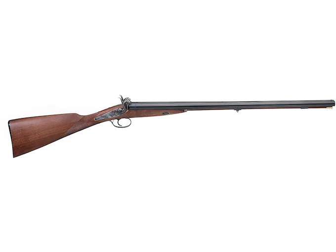

# Chapter Eighteen; Interesting people around town 



Cleo and Daisy Dobbins. I think this was their 50-year Anniversary Photo. AKA “Mr. & Mrs. Dobbins”. Mrs. Dobbins was a homemaker and Mr. Dobbins was a jack of all trade’s handyman. He grew up on a farm when you had to be a mechanic, blacksmith, electrician, welder, carpenter, and painter as well as a farmer. 
They had one child, a daughter, Aleen Brewer, who lived with her husband Earl, and son Earl JR. in the 300 block of Webb St. They later moved to Wichita, KN. Where Aleen got a job with the Cessna Aircraft Company. Their son, Earl JR. was about three years older than I. Earl SR. did not work, he had some physical problem, not Shure what it was.  They made several trips to Webb City during the year on Holidays and a two weeklong period which must have been Aleen’s vacation from Cessna Aircraft.  When they did visit, Earl JR. and I would hang out together. Which was good, because they would invite me to go with them to a campground in Branson, MO for a one weeklong stay on Lake Taneycomo in the heart of the Missouri Ozark mountains. I need to add that this was before the White River was Dammed creating the Table Rock Lake in 1958, upstream of the campground in Branson. Which put Branson “on the Map” and it became a world-famous destination.  We probably looked like the Beverly Hillbillies on our trip down to Branson. The Brewers would drive their car, the Dobbins drove their 54 Chevy towing a camper trailer that Mr. Dobbins built. It was all metal which he painted black. It looked kind of like a covered wagon. The grownups would pitch a tent big enough for all four of them and slept on a cot. Earl Jr. and I slept on the ground in an Army Surplus two-man pup tent. Earl Sr. and Mr. Dobbins would rent a boat powered by a 9.9 -HP Johnson outboard motor which Mr. Dobbins would have tuned up and ready to go ahead of time. He had a 55-gal drum filled with water so he could run it right there in his back yard. They caught several fish which were good along with the side dishes Mrs. D and Aleen cooked up. Earl Jr. and I had a rowboat that we played on but were told not to get too far away from camp. Mr. D explained that it would be best if we rowed upstream so it would be easy to get back to camp. We tested that theory by going downstream first, and sure enough, he was right.  Camping out at Lake Taneycomo is one of my favorite memories.

Mr. D loved to fish. He had a neighbor, two doors down Liberty St., Mr. Ensminger who was his fishing buddy. When Mr. Ensminger died Mr. D would invite Murph and I to go fishing with him. We would go out to Spring River about 5 miles North of town and camp out on weekends. There was (and still is) a campground on the East side of the river called Quaker Mill Park.

The old mill was gone but there was a general store where it used to be. They rented camp sites for a day, weekend, or for a whole week. We did that once; Mrs. Dobbins came out with us that time. Mr. D would always ask for the site just upstream from the bridge where the boat ramp was located. MR. D, (and Murph) were very serious fisherman. On the first day we would go out to Buck’s Branch North of Alba and use a sane net to catch small fish for bait on a trot line and bank lines. The trot line was long, it stretched upstream from our campsite for about 50 yards. Several bank lines were hung from overhanging tree branches for the same distance along the bank. MR. D and Murph would get in the boat and bait the hooks on the trotline by pulling the boat upstream, using the trot line. Then bait the bank lines on the way back to camp. The same method was used to check the lines and remove fish that were caught, and more bait set out. This was hard work and took most of the day getting everything set up.  And the process was repeated several times, even after dark cause it would be dark by the time everything was ready. My main job was keeping the campfire going. I’ll never forget the first time I heard a screech owl. Mr. D and Murph had just got back from their second trip collecting fish and baiting the lines.  We were sitting around the campfire. It was a very dark night and getting a little cool.  We had been sitting around the fire listening to some of MR. D’s stories when the owl, which was in a tree directly overhead let out a screech.  I just about jumped out of my skin. MR. D and Murph died laughing, they had been waiting for the moment, and my reaction. We spent a lot of time out on old mill park over the years.  Caught a lot of fish, had some good times, and made some great memories.

Mr. Dobbins was self-employed, his main job was mowing lawns, which kept him very busy during the summer months. My oldest Brother Murph worked for him for several summers, then David, then Me. He drove a 1930 Chevy Coupe which he converted to a work truck. He removed the rear jump seat and door then inserted a wooden bed that he built.  He had two homemade lawnmowers and a tractor which he built himself. He had a large Barn behind his house with a workshop, a loft and room to park two cars end to end. The shop had a nice metal potbellied stove. There was a bin in the conner facing the alley behind the barn where coal was delivered. In the SW conner of the barn was a contraption he built to make feather bed mattresses, and pillows. He even built a fishing boat out of two car hoods he welded together.

He was fun to work for, but the pay was not too good. He would tell the customers “I get $1.50 an hour and the Boy gets 50 cents an hour.” But the Boy only got 25 cents an hour. A day’s work varied with the number of jobs, but I don’t remember ever working more than five or six hours. He didn’t hire us every day, just on the big jobs that required extra help. I remember one lawn out on Range Line south of Granny Shafer’s that must have been one or two and a half acres.  Still Mr. Dobbins was fun to work for and I loved riding around town in that old 1930 Chevy.

I learned a lot too. How to get a drink of water from the outside water spicket on a hot day. He told me “Never drink from the hose, the water will be hot and taste like rubber, and you might swallow a spider. “Disconnect the hose from the faucet, turn on the water, cup your hand to drink. And, on a hot day, you can splash some water on your head to cool off. I remember the first time he showed me how to use his edger, an old meat cleaver. He showed me how to chop the grass and a little dirt along the sidewalk or curb and it looked good. I was having a hard time getting the hang of it so he demonstrated a few times, and I would try again. He could see that I was getting frustrated and mad, so he stopped me and said, “Now Jimmie, it’s not that I’m so smart. It’s just that I’ve been doing this for a long time. “Now let’s try it again. I finally mastered it and cut a nice clean edge from then on.

## The Cap and Ball shotgun

Mr. Dobbins had an old civil war era double barrel shotgun in the barn behind his house. When Earl JR. and his parents I would come for a visit, the barn was our favorite place to play. We would always get the shotgun out and look it over. We had a lot of fun with it. with it. It was in really good shape for a gun that old. One summer day, MR. Dobbins was out in his back yard working.  Melvin and David asked me to go over and ask him if I could have that gun. I was kind of shy about that, but I did call him over to the fence and ask him. Without hesitation, he went over to his barn, got the gun and gave it to me.

I was amazed and very happy.   From that point on for years we had a grand time with that old gun, especially around the 4th of July.
We would drop firecrackers down the barrels and when they went off it was just like the real sound of a shotgun along with plenty of smoke coming out of the barrels. Another thing we would do is cut up cap pistol caps, fit three or four in each hammer where the old cap was to go (those little black dots were real black powder) which produced a very loud report and lots of smoke.  That old gun provided many years of fun and enjoyment for us boys.
I’m not Shure what happened to the gun. Melvin took it with him when he moved to MT. Vernon, MO after he married Norma when he worked on the I44 highway project for the Missouri Highway Department. His plan was to Restore it to its original condition. I never saw it again.

Mr. Dobbins was a WW1 Vet. He had a big photograph of his Regiment in uniform, taken prior to their shipping out to Europe. He never talked about the war.  I mentioned earlier that Mr. Dobbins was raised on a farm. He had some relatives who still lived on a farm East of Webb city near Mt. Vernon.  When the Brewers would come down from Kansas for a visit they liked to go up to the farm for a visit. I went along to be company for Earl JR. The farm was very nice, and so were the relatives. I couldn’t get over the size of their dinner table, or the great food which was served.

Earl JR. and I had a great time at the farm which was very big with a nice barn with lots of tractors and farm implements to check out. One time MR. Dobbins suggested that if we wanted to, we could bring our shotguns along and go hunting in the woods surrounding the farm. Earl JR. borrowed MR, Dobbins single shot 410 and I brought my Mossberg bolt action 410 which would hold three shells. Mr. D and Earl SR. came along to keep us out of trouble. We had just gotten into the woods when we saw a squirrel in a tree. We both opened fire as the squirrel jumped from branch to branch, tree to tree. Tree limbs and leaves were falling like rain. Six shots were fired and no squirrel. MR. D and Earl SR. died laughing. We were embarrassed, and that was one lucky squirrel.

Our favorite pastime for Earl Jr. and Me was the old tractor out by the barn.  The farmer told us, you can’t hurt it, but it can hurt you. So be careful and have fun”. And we did have fun.

## Mr. and Mrs. Allen

I wish I had a 1949 Webb City phone book.  
The Allen’s lived directly across Liberty St. and two doors down from our house. They had one son Gallen. Same age as Vern.  Those two were always getting into trouble. Mr. Allen worked for Webb Corp in Webb city. He had a wood working/Mechanical shop in the garage behind their house. Mrs. Allen was a homemaker, a very quiet and sweet lady. They were next door neighbors to the Bauer’s on the North, and the Roushe family to the South of their home.
Mr. Allenn mowed his lawn with and electric lawn mower that he built himself, mind you this was in the 1940’s, no batteries, but a long extension cord and outside AC receptacles all around the outside of the house which he installed himself. The mower was the single blade rotor type, not the common reel type used at that time. The mower was very quiet, uncommon for a power mower. He should have gotten a patten on it.  I guess he wasn’t looking to get rich, he just wanted a nice practical, quiet lawn mower.
Mom went to him for help with a project she was working on. A neighbor across Ayler street to the South of her had an old pie safe in this back ward. It had been painted white and had been out in the weather for some time.  She bought it for two dollars and fifty cents.  Put it out in her garage and began to strip the old paint off and refinish it.  The top, however, was in bad shape. The top board was warped and bowed. She took it over to him and asked if he could measure it and cut her a new piece of wood to match it. He said, “I think I can fix this one.” Which he did, he cut several groves across the bottom and put glue in the groves, then flattened it out with weights. It was perfectly flat when he was done.  Mom was delighted to have the original piece of wood that matched the rest of the Pie Safe.
(INCERT PHOTO)
Add that mom had restored a pie safe for Dave and Ann and Murph and Norma. And one for Vern and Shirley.  This one was for Kathy and I.
Ernie Burns Junkyard
Indian Charlie & Mrs. Rigs
