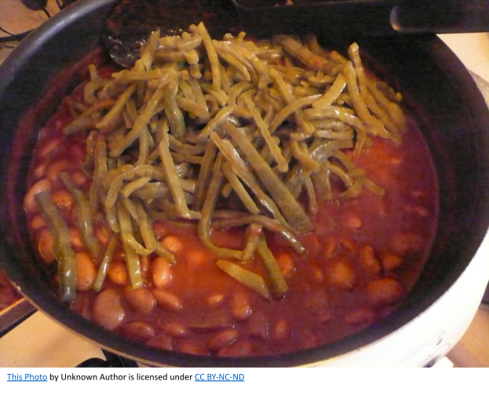

# Cindy’s Café Main St. Webb City

On Main St. at the alley which ran behind the pool hall from Webb to Main. Small café where you could get a bowl of chili, a handful of saltine crackers and a small coke for 20 cents. Not a bad lunch for 20 cents. I was told that this is where Geraldine Gastineau (Kitty Boo) got her first job as a waitress. She worked at Wilder’s restaurant in Joplin for many years. And later Catered parties and reunions. She Catered sone of our class of 61 reunions and would always ask me about David. She and David were in the class of 68. 

